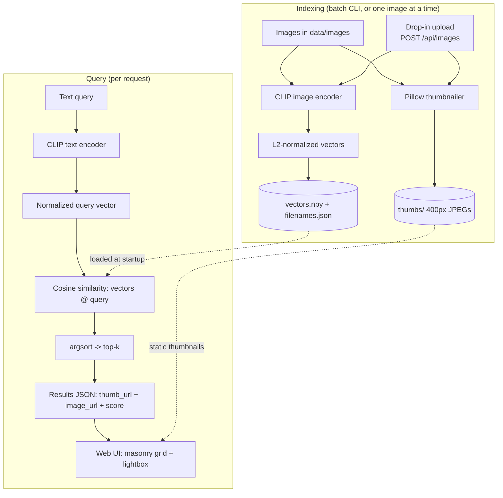

# Image Semantic Search

Search a folder of images by describing what you want in plain language. Type
"a dog running on the beach" and the gallery is ranked by *meaning*, not filenames
or tags.

It works because a single CLIP model maps both images and text into one shared
vector space. Indexing encodes every image once; a query encodes your text once and
compares it against the stored image vectors with a single dot product. No tagging,
no vector database, no external API.

## Demo


## How it works

A small FastAPI backend serves a precomputed index and a static single-page UI:

- **`src/embeddings.py`** wraps CLIP (`clip-ViT-B-32` via `sentence-transformers`)
  and returns L2-normalized vectors, so a dot product equals cosine similarity.
- **`src/index.py`** is a CLI that embeds a folder of images and persists three
  things to `data/index/`: `vectors.npy` (the matrix of image vectors),
  `filenames.json` (the row order), and `thumbs/` (400px JPEG thumbnails).
- **`src/app.py`** loads the model and the index once at startup, then answers
  `GET /api/search?q=...&k=...` with the top-k matches and serves the UI plus
  original images and thumbnails as static files.
- **`web/index.html`** is a zero-build (Tailwind via CDN) front end: a search bar,
  a masonry results grid with similarity scores, and a lightbox.

## Usage

```bash
# 1. Install dependencies (PyTorch, CLIP, FastAPI, etc.)
pip install -r requirements.txt

# 2. Build the index from a folder of images.
#    This embeds each image and writes vectors + thumbnails to data/index/.
python -m src.index data/images

#    Later, after adding or removing images, sync incrementally instead of
#    re-embedding everything (only new images are encoded):
python -m src.index data/images --update

# 3. Run the server.
uvicorn src.app:app --reload

# 4. Open the UI.
open http://localhost:8000
```

The first run downloads the CLIP model weights (a few hundred MB), so it takes a
moment; subsequent runs are fast. The server expects images in `data/images` and a
prebuilt index in `data/index` (both are the defaults baked into `src/app.py` and
`src/index.py`).

### Run with Docker

The image bundles CPU-only PyTorch, the CLIP model, and a prebuilt index for the
sample images, so it starts instantly and runs fully offline.

```bash
docker build -t imgsearch .
docker run --rm -p 8000:8000 imgsearch
# open http://localhost:8000
```

To search your own folder, mount it and rebuild the index at start:

```bash
docker run --rm -p 8000:8000 -v /path/to/photos:/app/data/images \
  imgsearch sh -c "python -m src.index data/images && uvicorn src.app:app --host 0.0.0.0 --port 8000"
```

### API

```
GET  /api/search?q=<text>&k=<1..50>
POST /api/images            (multipart form field: file)
```

`GET /api/search` returns the query echoed back, `took_ms`, and a `results` array of
`{ filename, thumb_url, image_url, score }`, sorted by descending cosine similarity.

`POST /api/images` adds one uploaded image to the live index, embedding just that image,
and returns `{ filename, indexed, total }`. It is searchable immediately.

## Evaluation

`eval.py` scores retrieval quality against a set of labeled queries. It reuses
`ClipEmbedder` and `load_index` directly (no HTTP), so it measures the exact search
path the API uses, reporting top-1 accuracy and precision@5 per query.

It then sweeps the `min_score` cutoff from 0.15 to 0.30 and reports the value with the
highest F1 over every query-image pair. The API defaults to `min_score=0.22` (within
that useful band, favouring recall for interactive search).

```bash
python -m eval                       # local, needs deps + a prebuilt data/index
docker run --rm imgsearch python -m eval   # inside the container (index is bundled)
```

## Flow



## Core questions

**Why CLIP?**
**One model puts images and text in the same vector space, so search is just comparing a
text vector to image vectors.** No per-image captioning or tagging, and queries can be any
natural-language phrase instead of a fixed label set.

**Why no vector database?**
**At folder scale the index is a NumPy array and search is one matrix-vector multiply
(`vectors @ query`): simpler to run and deploy, and instant for thousands of images.**
Reach for a real index only when a linear scan stops being instant or you need more than search:
- **FAISS**: in-process, scales to millions of vectors with approximate nearest-neighbor search.
- **pgvector**: when vectors should live next to relational data and be queried with SQL, or
  you need persistence, filtering, and concurrent writers.

**How it stays cheap.**
**The CLIP model runs locally, so there is zero per-query API cost.** The index loads into
memory once at startup as a single NumPy array, and the UI serves 400px thumbnails instead of
full-resolution originals to keep bandwidth and memory low.

**How it achieves low latency.**
**Image vectors are embedded and L2-normalized ahead of time, so a query is one text
embedding, one matrix-vector multiply, and an `argsort` for the top-k.** Normalized vectors
mean the dot product already is the cosine similarity (no per-comparison division), the model
and index load once rather than per request, and thumbnails are served as static files.

**Limitations / what is next.**
- The index loads into memory at startup; `--update` re-syncs incrementally (encoding only new
  images) and a drop-in upload via `POST /api/images` indexes a single image on demand, but
  there is no live hot-reload.
- In-memory and single-process: no auth, pagination, or horizontal scaling.
- Search is a full linear scan, fine at folder scale; see the FAISS/pgvector note above for
  when to swap it out.
- Ranking quality is bounded by CLIP `ViT-B/32`; a larger variant trades latency for accuracy.
- No re-ranking, metadata filtering, or hybrid (keyword + vector) search yet.

## How this was built

This repository was built by orchestrating parallel AI agents under explicit
verification gates, not by coding linearly or trusting model output blindly. The
operating discipline is in [`CLAUDE.md`](CLAUDE.md), the orchestration scripts are in
[`workflows/`](workflows/), and the full build narrative is in
[`docs/HOW-THIS-WAS-BUILT.md`](docs/HOW-THIS-WAS-BUILT.md).
